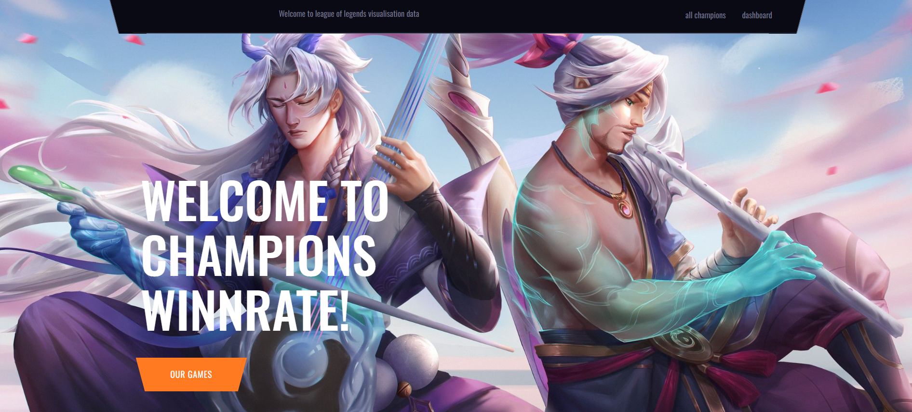
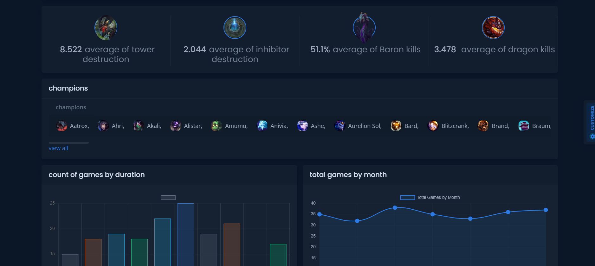
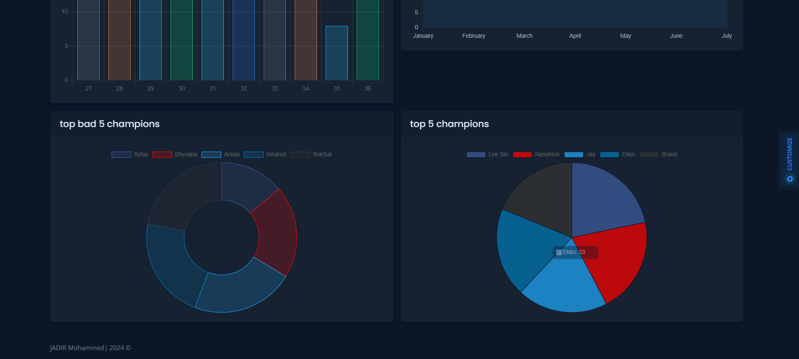
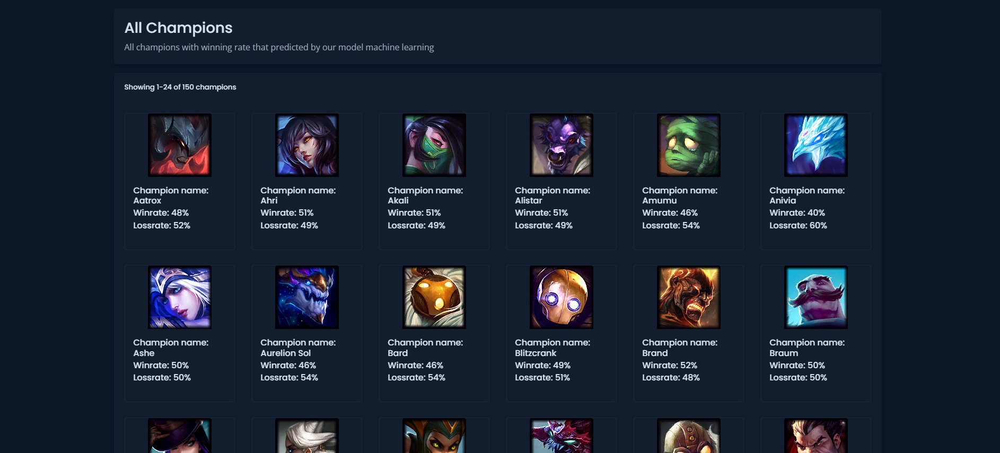

# Django School
# League of Legends Data Visualization Application

This application visualizes data from League of Legends to provide insights and analysis on player statistics, game performance, and more.

## Features

- Interactive dashboards to explore player statistics.
- Visualization of match history and performance metrics.
- Custom filters to analyze specific data points.

[](https://python.org)
[](https://djangoproject.com)

This is an example project to illustrate an implementation of multiple user types. In this Django app, teachers can create quizzes and students can sign up and take quizzes related to their interests.
HOME PAGE:


Dashboard:

Dashboard 1:

champions 2:

champions:



## Running the Project Locally

First, clone the repository to your local machine:

```bash
git clone https://github.com/Jadir99/league-of-legend-prediction-win.git
```

Install the requirements:

```bash
pip install -r requirements.txt
```

Create the database:

```bash
python manage.py migrate
```

Finally, run the development server:

```bash
python manage.py runserver
```

The project will be available at **127.0.0.1:8000**.


